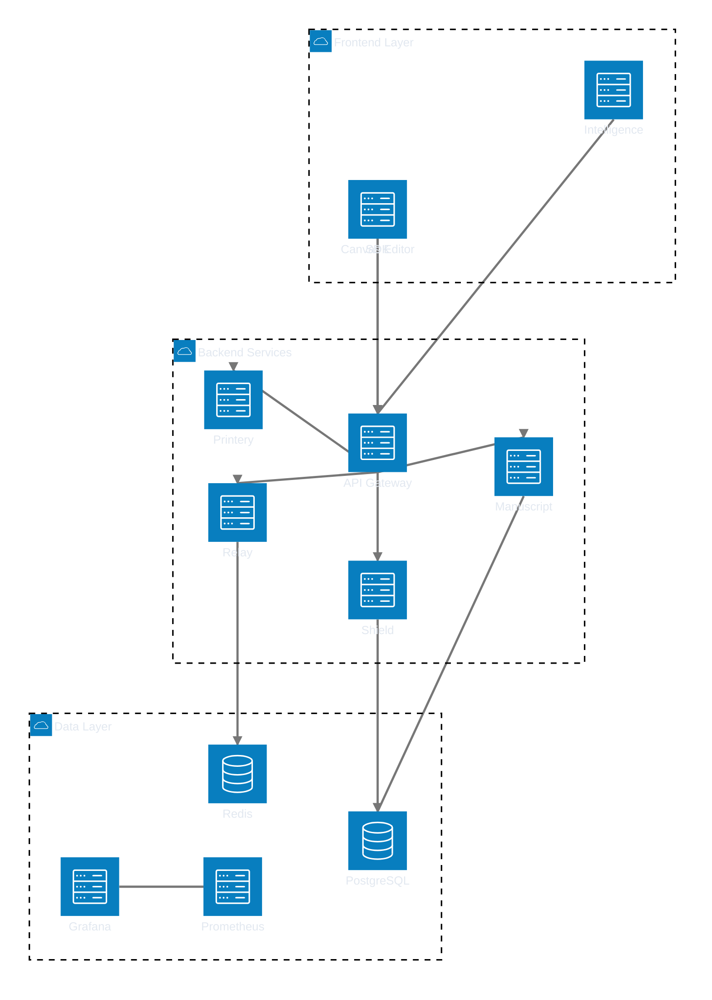
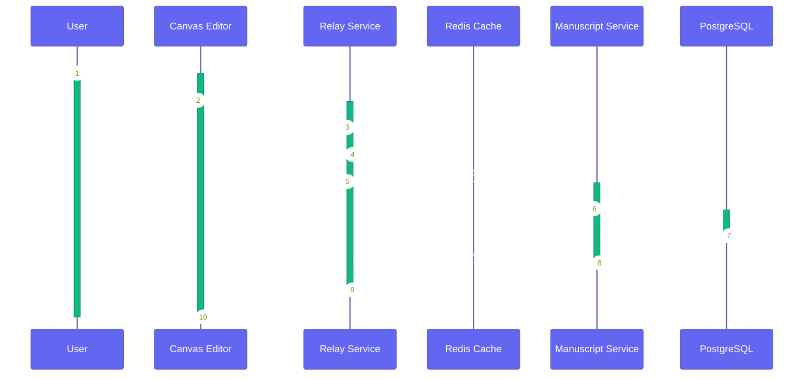
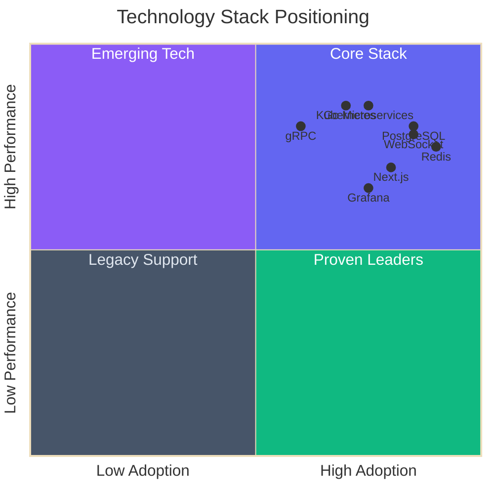
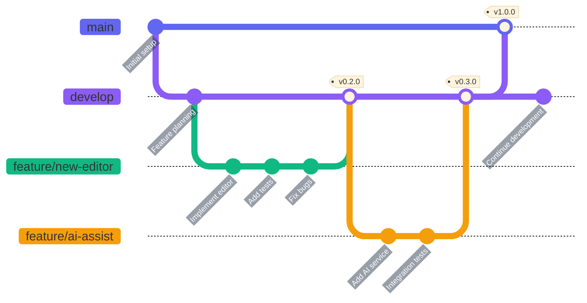
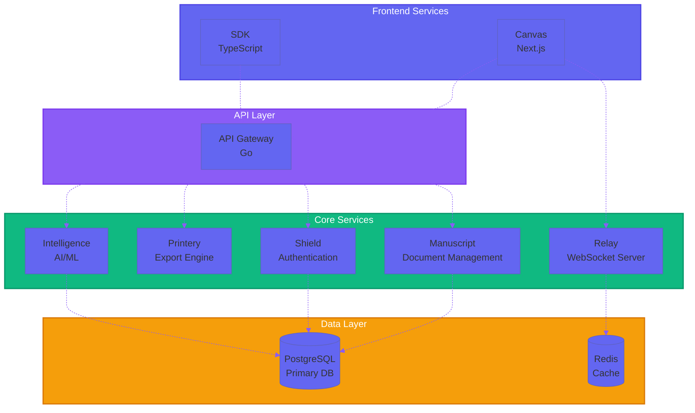
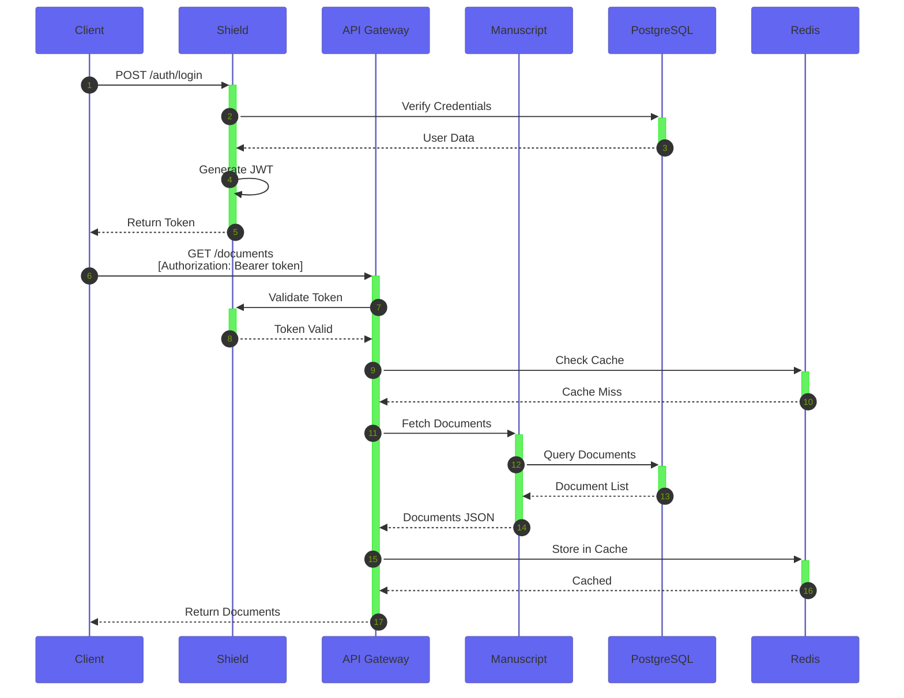

<div align="center">

# Materi

### The Intelligent Document Platform for Modern Teams

[](https://getmateri.com)
[](#)
[](https://getmateri.com)

<p align="center">
  <em>Empowering teams to create, collaborate, and scale content with intelligent automation and real-time collaboration</em>
</p>

[Platform](#architecture) · [Features](#core-features) · [Technology](#technology-stack) · [Documentation](#documentation) · [Contributing](#contributing)

</div>

---

## Overview

Materi is a next-generation document collaboration platform that combines the familiarity of traditional editors with intelligent content management and real-time collaboration. Built for teams who demand speed, consistency, and scale.

### Why Materi?

-   **Fragment System** — Reusable content blocks that maintain consistency across all documents
-   **AI-Powered Writing** — Intelligent suggestions and automated content generation
-   **Real-Time Collaboration** — Built-in presence, comments, and live editing
-   **Knowledge Management** — Institutional memory that grows with your team
-   **API-First Design** — Extensible platform for custom workflows and integrations

---

## Architecture

Materi is built as a distributed microservices platform with a focus on scalability, reliability, and developer experience.

### System Architecture



### Real-Time Collaboration Flow



### Document Processing Pipeline

```mermaid
%%{init: {'theme':'base', 'themeVariables': { 'primaryColor':'#6366f1','primaryTextColor':'#fff','lineColor':'#8b5cf6'}}}%%
flowchart LR
    A([User Request]) --> B{Request Type}
    B -->|Create| C[Manuscript Service]
    B -->|Edit| D[Relay Service]
    B -->|Export| E[Printery Service]
    B -->|AI Assist| F[Intelligence Service]

    C --> G[(PostgreSQL)]
    D --> H[(Redis Cache)]
    E --> I[PDF Engine]
    F --> J[LLM Provider]

    G --> K([Success Response])
    H --> K
    I --> K
    J --> K

    style A fill:#10b981,stroke:#059669,stroke-width:2px
    style K fill:#10b981,stroke:#059669,stroke-width:2px
    style B fill:#6366f1,stroke:#4f46e5,stroke-width:2px
    style C fill:#8b5cf6,stroke:#7c3aed,stroke-width:2px
    style D fill:#8b5cf6,stroke:#7c3aed,stroke-width:2px
    style E fill:#8b5cf6,stroke:#7c3aed,stroke-width:2px
    style F fill:#8b5cf6,stroke:#7c3aed,stroke-width:2px
    style G fill:#334155,stroke:#475569,stroke-width:2px
    style H fill:#334155,stroke:#475569,stroke-width:2px
    style I fill:#334155,stroke:#475569,stroke-width:2px
    style J fill:#334155,stroke:#475569,stroke-width:2px
```



### Technology Decisions



### Repository Structure

````mermaid
%%{init: {'theme':'base', 'themeVariables': { 'primaryColor':'#6366f1','fontSize':'14px'}}}%%
mindmap
  root((Materi))
    products
      Canvas Editor
        Next.js
        TypeScript
        Tiptap
      SDK
        TypeScript
        REST Client
        WebSocket Client
    domain
      API Gateway
      Manuscript Service
      Printery Service
      Relay Service
      Shield Auth
    platform
      Atlas Infrastructure
      Intelligence AI/ML
    operations
      Kubernetes
      Monitoring
        Grafana
        Prometheus
        Loki
      Terraform
      CI/CD
    shared
      Protocol Buffers
      Contracts

---

## Core Features

### Fragment-Based Content Management

Reusable content blocks that maintain consistency and accelerate content creation across your organization.

```mermaid
%%{init: {'theme':'base', 'themeVariables': { 'primaryColor':'#6366f1','lineColor':'#8b5cf6'}}}%%
flowchart TB
    subgraph fragments[Fragment Library]
        F1[Legal Disclaimer]
        F2[Product Description]
        F3[Contact Info]
        F4[Brand Guidelines]
    end

    subgraph docs[Documents]
        D1[Sales Proposal]
        D2[Marketing Brief]
        D3[Legal Contract]
    end

    F1 -.-> D1 & D3
    F2 -.-> D1 & D2
    F3 -.-> D1 & D2 & D3
    F4 -.-> D2

    style fragments fill:#8b5cf6,stroke:#7c3aed,stroke-width:2px,color:#fff
    style docs fill:#6366f1,stroke:#4f46e5,stroke-width:2px,color:#fff
    style F1 fill:#7c3aed,stroke:#6d28d9,color:#fff
    style F2 fill:#7c3aed,stroke:#6d28d9,color:#fff
    style F3 fill:#7c3aed,stroke:#6d28d9,color:#fff
    style F4 fill:#7c3aed,stroke:#6d28d9,color:#fff
    style D1 fill:#4f46e5,stroke:#4338ca,color:#fff
    style D2 fill:#4f46e5,stroke:#4338ca,color:#fff
    style D3 fill:#4f46e5,stroke:#4338ca,color:#fff
````

### Real-Time Collaboration

Built on WebSocket infrastructure with operational transformation for seamless multi-user editing.

### AI Writing Assistant

Intelligent suggestions, tone analysis, and automated content generation powered by modern LLMs.

```mermaid
%%{init: {'theme':'base', 'themeVariables': { 'primaryColor':'#6366f1','lineColor':'#8b5cf6'}}}%%
sequenceDiagram
    participant U as User
    participant C as Canvas
    participant I as Intelligence
    participant LLM as LLM Provider

    U->>C: Type Content
    C->>I: Request Suggestions
    I->>LLM: Analyze Context
    LLM-->>I: Return Suggestions
    I-->>C: Display Options
    C-->>U: Show AI Recommendations
    U->>C: Accept Suggestion
    C->>C: Apply Changes
```

### Enterprise-Ready Security

Role-based access control, audit logging, and SOC 2 compliance readiness.

### Extensible API

RESTful and GraphQL APIs with comprehensive SDK support for custom integrations.

---

## Technology Stack

### Frontend

-   **Next.js 14** — React framework with App Router
-   **TypeScript** — Type-safe development
-   **TailwindCSS** — Utility-first styling
-   **Tiptap** — Extensible rich-text editor

### Backend

-   **Go** — High-performance microservices
-   **PostgreSQL** — Primary data store
-   **Redis** — Caching and session management
-   **gRPC** — Inter-service communication

### Infrastructure

-   **Kubernetes** — Container orchestration
-   **Railway** — Cloud deployment platform
-   **Grafana Stack** — Observability (Loki, Prometheus, Tempo)
-   **Alloy** — Unified telemetry collection

### DevOps

-   **Terraform** — Infrastructure as code
-   **GitHub Actions** — CI/CD pipelines
-   **Docker** — Containerization

### Deployment Architecture

```mermaid
%%{init: {'theme':'base', 'themeVariables': { 'primaryColor':'#6366f1','primaryTextColor':'#fff','lineColor':'#8b5cf6'}}}%%
C4Deployment
    title Materi Production Deployment Architecture

    Deployment_Node(cdn, "CDN", "Cloudflare") {
        Container(static, "Static Assets", "Next.js", "Optimized bundles")
    }

    Deployment_Node(railway, "Railway Platform", "Cloud Infrastructure") {
        Deployment_Node(k8s, "Kubernetes Cluster", "Container Orchestration") {
            Container(canvas, "Canvas", "Next.js", "Document editor")
            Container(api, "API Gateway", "Go", "Request routing")
            Container(manuscript, "Manuscript", "Go", "Document management")
            Container(relay, "Relay", "Go", "WebSocket server")
            Container(printery, "Printery", "Go", "Export service")
            Container(shield, "Shield", "Go", "Authentication")
        }

        Deployment_Node(data, "Data Services", "Managed Services") {
            ContainerDb(postgres, "PostgreSQL", "Database", "Primary data store")
            ContainerDb(redis, "Redis", "Cache", "Session & real-time")
        }

        Deployment_Node(monitoring, "Observability", "Grafana Cloud") {
            Container(grafana, "Grafana", "Dashboard", "Metrics visualization")
            Container(loki, "Loki", "Logs", "Log aggregation")
            Container(prometheus, "Prometheus", "Metrics", "Time-series DB")
        }
    }

    Deployment_Node(client, "User Devices", "Browser/Mobile") {
        Container(browser, "Web Browser", "Chrome/Safari/Firefox", "User interface")
    }

    Rel(browser, cdn, "Loads assets", "HTTPS")
    Rel(browser, canvas, "Interacts", "HTTPS/WSS")
    Rel(canvas, api, "API calls", "HTTPS")
    Rel(api, manuscript, "gRPC", "Internal")
    Rel(api, printery, "gRPC", "Internal")
    Rel(api, shield, "gRPC", "Internal")
    Rel(canvas, relay, "WebSocket", "WSS")
    Rel(relay, redis, "Pub/Sub", "Redis Protocol")
    Rel(manuscript, postgres, "Queries", "PostgreSQL")
    Rel(shield, postgres, "Auth data", "PostgreSQL")
    Rel(k8s, prometheus, "Metrics", "Remote Write")
    Rel(k8s, loki, "Logs", "HTTP")
```

---

## Documentation

| Resource                                                  | Description                  |
| --------------------------------------------------------- | ---------------------------- |
| [🏠 Website](https://getmateri.com)                       | Official product website     |
| [📚 API Docs](#)                                          | RESTful API reference        |
| [🔧 SDK Documentation](#)                                 | TypeScript SDK guide         |
| [🏃 Quick Start](#)                                       | Get started in 5 minutes     |
| [🏗️ Architecture Guide](./docs/)                          | System design and patterns   |
| [📊 Monitoring Runbook](./docs/MATERI-GRAFANA-RUNBOOK.md) | Operations and observability |

---

## Contributing

We welcome contributions from the community! Whether you're fixing bugs, improving documentation, or proposing new features.

### Getting Started

1. **Clone the repository**

    ```bash
    git clone https://github.com/your-org/materi.git
    cd materi
    ```

2. **Set up your environment**

    ```bash
    make setup
    ```

3. **Run locally**
    ```bash
    make dev
    ```

### Development Workflow



### Contribution Guidelines

```mermaid
%%{init: {'theme':'base', 'themeVariables': { 'primaryColor':'#6366f1','lineColor':'#8b5cf6'}}}%%
flowchart LR
    A([Fork Repository]) --> B[Create Branch]
    B --> C{Type of Change}
    C -->|Bug Fix| D[Write Tests]
    C -->|Feature| E[Write Tests & Docs]
    C -->|Docs| F[Update Documentation]

    D --> G[Make Changes]
    E --> G
    F --> G

    G --> H[Run Tests Locally]
    H --> I{Tests Pass?}
    I -->|No| G
    I -->|Yes| J[Commit Changes]

    J --> K[Push to Fork]
    K --> L[Create Pull Request]
    L --> M[CI/CD Pipeline]
    M --> N{All Checks Pass?}
    N -->|No| O[Fix Issues]
    O --> J
    N -->|Yes| P[Code Review]
    P --> Q{Approved?}
    Q -->|No| R[Address Feedback]
    R --> J
    Q -->|Yes| S([Merged])

    style A fill:#10b981,stroke:#059669,stroke-width:2px
    style S fill:#10b981,stroke:#059669,stroke-width:2px
    style C fill:#6366f1,stroke:#4f46e5,stroke-width:2px
    style I fill:#f59e0b,stroke:#d97706,stroke-width:2px
    style N fill:#f59e0b,stroke:#d97706,stroke-width:2px
    style Q fill:#f59e0b,stroke:#d97706,stroke-width:2px
```



### Development Workflow

-   Review our [Development Guide](./docs/ONBOARDING_INTERN.md)
-   Follow the [Code Style Guidelines](#)
-   Submit pull requests to the `main` branch
-   Ensure all tests pass and maintain coverage

---

## Key Projects

| Project          | Description                      | Tech Stack                  |
| ---------------- | -------------------------------- | --------------------------- |
| **Canvas**       | Main document editor application | Next.js, TypeScript, Tiptap |
| **Manuscript**   | Document management service      | Go, PostgreSQL              |
| **Printery**     | Export and rendering engine      | Go, PDF generation          |
| **Relay**        | Real-time collaboration service  | Go, WebSocket, Redis        |
| **Intelligence** | AI and ML services               | Python, TypeScript          |
| **Shield**       | Authentication and authorization | Go, JWT                     |

### Service Dependencies



### API Request Flow



---

## Status & Health

-   **Production Status** — Live and serving customers
-   **Monitoring** — Full observability with Grafana Stack
-   **Deployment** — Automated CI/CD pipeline
-   **Uptime** — 99.9% SLA target

---

## Contact & Community

-   **Website**: [getmateri.com](https://getmateri.com)
-   **Email**: hello@getmateri.com
-   **Twitter**: [@getmateri](#)
-   **LinkedIn**: [Materi](#)

---

## License

Copyright © 2026 Materi. All rights reserved.

This software is proprietary. Unauthorized copying, distribution, or modification is strictly prohibited.

---

<div align="center">

**Built by the Materi Team**

<sub>Making document collaboration intelligent, scalable, and delightful</sub>

</div>
